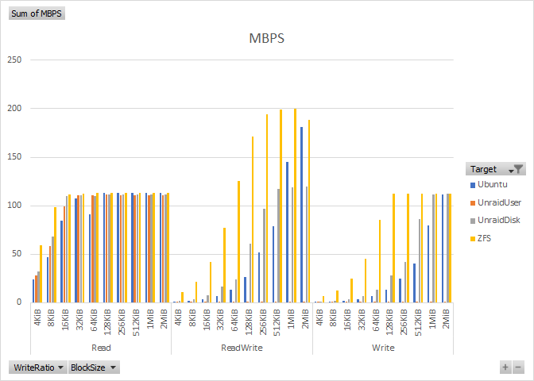

# DiskSpeedTest

Utility to automate iterative IO performance tests.  

The tool includes two tests:

- Automating iterative [DiskSpd](https://github.com/microsoft/diskspd) runs with varying block sizes and varying read/write ratios.
- Recursive file create, write, read, and delete operations.

## License

[](./LICENSE)  
Licensed under the [MIT License](./LICENSE)

## Project

  
Code is on [GitHub](https://github.com/ptr727/DiskSpeedtest).  
CI is on [Azure DevOps](https://dev.azure.com/pieterv/DiskSpeedTest).

## Build Status

[](https://dev.azure.com/pieterv/DiskSpeedtest/_build/latest?definitionId=32&branchName=master)


## Getting Started

### Installation

- Install the [.NET Core 3.1 Runtime](https://dotnet.microsoft.com/download) and [download](https://github.com/ptr727/DiskSpeedTest/releases/latest) pre-compiled binaries.
- Or compile from [code](https://github.com/ptr727/DiskSpeedtest.git) using [Visual Studio 2019](https://visualstudio.microsoft.com/downloads/) or [Visual Studio Code](https://code.visualstudio.com/download) or the [.NET Core 3.1 SDK](https://dotnet.microsoft.com/download).
- Download [DiskSpd](https://aka.ms/diskspd), and place the `diskspd.exe` binary in the path or the working directory.

### Configuration

```jsonc
{
  // Add a timestamp to the result output filenames
  "timestampresultfile": false,
  // DiskSpeedTest config
  "diskspeedtest": {
    // Enable this test
    "enabled": true,
    // Output CSV file
    "resultfile": "DiskSpeedResult.csv",
    // Test targets, full path and filename, directory must exist, file will be created
    "targets": [
      "C:\\Temp\\DiskSpeedData.dat",
      "\\\\Server\\Share\\DiskSpeedData.dat"
    ],
    // File size of test target in bytes
    "targetsize": 68719476736,
    // Block size in bytes, automatically generated by doubling the beginning value until the end size is reached
    "blocksizebegin": 4096,
    "blocksizeend": 2097152,
    // Warmup time in seconds, do IO but don't use the values in computed results
    "warmuptime": 30,
    // Test time in seconds
    "testtime": 120,
    // Time to rest between test runs
    "resttime": 5
  },
  // FileIterationTest config
  "fileiterationtest": {
    // Enable this test
    "enabled": true,
    // Output CSV file
    "resultfile": "FileIterationResult.csv",
    // Test targets, full path, directory will be created, contents will be deleted
    "targets": [
      "C:\\Temp\\FileIteration",
      "\\\\Server\\Share\\FileIteration"
    ],
    // Folder depth for recursion
    "folderdepth": 2,
    // Folders per folder
    "foldersperfolder": 2,
    // Files per folder
    "filesperfolder": 1000,
    // File size in bytes
    "filesize": 65536
  }
}
```

### Run Tests

```console
C:\...\netcoreapp3.1>diskspeedtest.exe --help
DiskSpeedTest:
  Utility to automate iterative IO performance tests.

Usage:
  DiskSpeedTest [options] [command]

Options:
  --settings <settings> (REQUIRED)    Path to settings file.
  --version                           Show version information
  -?, -h, --help                      Show help and usage information

Commands:
  writedefaults    Write default values to settings file.
  runtests         Run all tests.
```

Example: `DiskSpeedTest.exe --settings DiskSpeedTest.json runtests`.

## CSV Output Files

Import the CSV results in Excel and use pivot tables for analysis.  

### DiskSpeedTest CSV Format

`UTC, Target, FileSize, BlockSize, WriteRatio, ThreadCount, OutstandingOperations, WarmupTime, TestTime, Bytes, IOS`

### FileIterationTest CSV Format

`UTC, Target, FileSize, FolderDepth, FoldersPerFolder, FilesPerFolder, FolderCount, FileCount, CreateTime, ReadTime, DeleteTime`

## Notes

- `DiskSpd` can be destructive, especially when running elevated, _**use at your own risk.**_
- `DiskSpd` will use privileged IO functions when running elevated. Test results will differ between running elevated or not, do not mix test results.
- Special considerations are made for COW and compressing filesystems, like ZFS with LZ4:
  - The default `DiskSpd -c` command used to create test target files creates semi-sparse files on ZFS with LZ4 compression, e.g. 64GiB file is 2GiB on disk.
  - For write testing on COW filesystems there is no point in pre-filling the file as all writes are in new blocks, but the same file is used for the read tests.
  - For read testing the read should result in disk IO, not just decompression, as may happen with sparse files or highly compressible content.
  - Instead of using `DiskSpd -c` to create the test file, the file is created and filled with random data such that the allocated size on disk is near identical to the logical size. This will mostly eliminate the benefits of LZ4 during reads, and test actual IO.
  - The `DiskSpd -Zr` option is used to randomize data in every write block, this adds some test overhead, but mostly prevents LZ4 from compressing the data and writing less IO than requested.

## Unraid SMB Performance

I wrote this tool to help troubleshoot [poor SMB performance](https://forums.unraid.net/bug-reports/stable-releases/slow-smb-performance-r566/) on [Unraid](https://unraid.net/), specifically concurrent writes or concurrent reads and writes.

For more details refer to my [blog](https://blog.insanegenius.com/tag/unraid/) posts.

After many tests I came to the conclusion that the performance degradation is caused by the Unraid User Share FUSE code.  
The results of various tests are [included](./DiskSpeedResult.xlsx) in the the repository.


